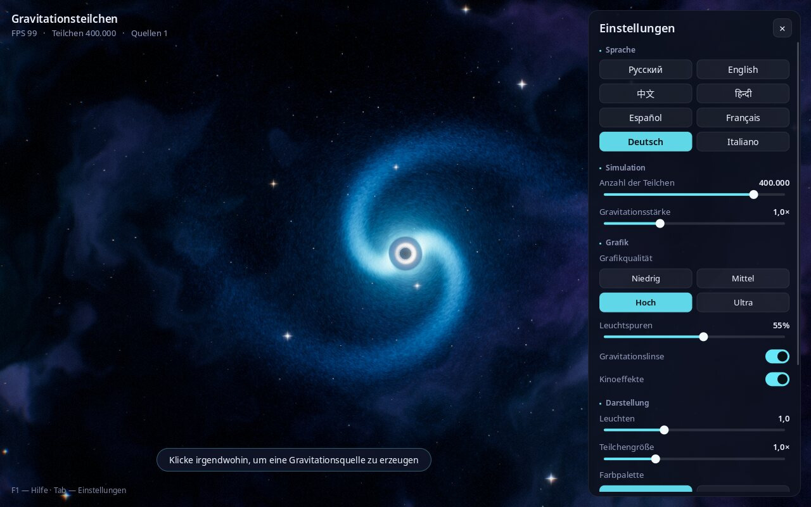

# Gravitationsteilchen

**Modellgrenzen:** künstlerische OpenGL-Visualisierung mit vereinfachter Dynamik;
kein relativistisches Modell und kein unabhängig bestätigter GPU/FPS-Benchmark.

[Русский](README.md) · [English](README.en.md) · [中文](README.zh.md) · [हिन्दी](README.hi.md) · [Español](README.es.md) · [Français](README.fr.md) · **Deutsch** · [Italiano](README.it.md)

**Ein interaktiver Weltraum-Sandkasten: Erschaffe Schwarze Löcher mit einem Mausklick und sieh zu, wie Hunderttausende leuchtende Teilchen um sie herum zu Galaxien wirbeln.**


---

## Was ist das?

Ein „Sandkasten“-Programm rund um die Schwerkraft. Auf dem Bildschirm siehst du den Weltraum: einen Nebel, Sterne und eine Galaxie aus Hunderttausenden Teilchen, die um ein Schwarzes Loch kreist.

Klicke irgendwohin – dort entsteht ein neues Schwarzes Loch. Es zieht Teilchen an, um es herum bildet sich eine eigene Galaxie, und benachbarte Galaxien beginnen, sich gegenseitig zu beeinflussen. Drücke die Leertaste, und alles fliegt wie bei einer Supernova auseinander – danach sammelt die Schwerkraft die Teilchen wieder ein.

Du musst nichts über Physik oder Programmierung wissen. Einfach zuschauen und ausprobieren: Farben, Stärke der Schwerkraft und Anzahl der Teilchen verändern. Ideal zum Entspannen, als Hintergrund auf einem großen Bildschirm, für den Astronomieunterricht und für Kinder.

## Was das Programm kann

- Konfigurationen bis zu einer Million Teilchen; FPS hängen von Hardware und Einstellungen ab.
- **Visuelle Schwarze-Loch-Effekte**: ein schwarzer Ereignishorizont, ein leuchtender Ring darum und gekrümmter Raum (wie im Film „Interstellar“).
- **Galaxien mit Spiralarmen**, die von selbst entstehen.
- **Schöne Effekte wie in modernen Spielen**: Leuchten, Leuchtspuren hinter den Teilchen, sanfte Helligkeitsanpassung, Schockwellen bei Explosionen.
- **4 Farbpaletten**: Kosmos, Neon, Regenbogen, Feuer.
- **Grafikqualitätsstufen** – von „Niedrig“ für einfache Laptops bis „Ultra“ für leistungsstarke Rechner.
- **Oberfläche in 8 Sprachen**: Russisch, Englisch, Chinesisch, Hindi, Spanisch, Französisch, Deutsch, Italienisch. Die Sprache wird automatisch nach der Systemsprache gewählt und kann jederzeit geändert werden.
- **Screenshots** per Tastendruck (F12) – fertige Desktop-Hintergründe.
- **Einstellungen bleiben** zwischen den Starts erhalten.

| Mehrere Schwarze Löcher und eine Schockwelle | Supernova-Explosion |
|---|---|
|  |  |

**Farbpaletten:** Kosmos, Neon, Regenbogen, Feuer


## Installation und Start

### Linux (Ubuntu, Debian, Mint, Fedora, Arch, openSUSE)

1. Programm herunterladen. Öffne ein **Terminal** (unter Ubuntu: `Strg` + `Alt` + `T`) und füge ein:
   ```bash
   git clone https://github.com/Anton-Sergeev-EA/gravity-particles.git
   ```
   Wenn der Befehl `git` nicht gefunden wird, klicke auf dieser Seite auf den grünen Button **Code → Download ZIP** und entpacke das Archiv.
2. Mit einem einzigen Befehl installieren:
   ```bash
   cd gravity-particles
   ./scripts/install-linux.sh
   ```
   Du wirst nach dem Administratorpasswort gefragt, um die nötigen Systemkomponenten zu installieren; danach wird das Programm gebaut und installiert. Das dauert etwa eine Minute.
3. Fertig! Suche **„Gravitationsteilchen“** im Anwendungsmenü.

Deinstallieren: `./scripts/install-linux.sh --uninstall`.

### Windows und macOS

Für Windows und macOS gibt es noch keine fertigen Installationsprogramme. Du kannst das Programm selbst bauen – siehe „Für Entwickler“ unten.

### Systemvoraussetzungen

- Linux, Windows 10/11 oder macOS.
- Eine Grafikkarte aus den letzten etwa 10 Jahren (OpenGL 3.3). Die integrierte Grafik eines Laptops reicht für die Qualität „Niedrig“ oder „Mittel“.

## Steuerung

| Aktion | So geht’s |
|---|---|
| Schwarzes Loch erschaffen | Linksklick |
| Schwarzes Loch verschieben | Linke Maustaste gedrückt halten und Maus bewegen |
| Alle Schwarzen Löcher außer dem mittleren entfernen | Rechtsklick |
| Supernova-Explosion | Leertaste |
| Farbpalette wechseln | `C` |
| Pause / Fortsetzen | `P` |
| Einstellungen ein-/ausblenden | `Tab` |
| Sprache wechseln | `L` |
| Screenshot speichern | `F12` |
| Vollbild / Fenster | `F11` |
| Hilfe | `F1` |
| Beenden | `Esc` |



## Was die Einstellungen bedeuten

Das Panel rechts wird mit `Tab` ein- und ausgeblendet.

- **Sprache** – Sprache der Oberfläche.
- **Anzahl der Teilchen** – wie viel „Sternenstaub“ auf dem Bildschirm ist. Mehr sieht schöner aus, belastet aber den Rechner stärker.
- **Gravitationsstärke** – wie stark Schwarze Löcher Teilchen anziehen.
- **Grafikqualität** – Stufen: Niedrig, Mittel, Hoch, Ultra. Wenn das Programm ruckelt, wähle eine niedrigere.
- **Leuchtspuren** – Länge der leuchtenden Spuren hinter den Teilchen. 0 % – keine Spuren.
- **Gravitationslinse** – Krümmung des Raums um Schwarze Löcher.
- **Kinoeffekte** – leichte Abdunklung der Ränder, Filmkorn, dezente Farbsäume an den Bildrändern und Kamerawackeln bei Explosionen.
- **Leuchten** – Stärke des Glanzes heller Bereiche.
- **Teilchengröße** – Dicke der Teilchen.
- **Farbpalette** – Farbschema.
- **Standardeinstellungen** – alles zurücksetzen.

Screenshots (F12) werden im Ordner „Bilder / Gravity Particles“ gespeichert.

## Wenn etwas nicht funktioniert

- **Das Programm ruckelt.** Öffne die Einstellungen (`Tab`), wähle die Qualität „Niedrig“ oder „Mittel“ und verkürze die Leuchtspuren.
- **Schwarzer Bildschirm oder das Programm startet nicht.** Wahrscheinlich unterstützt die Grafikkarte oder der Treiber kein OpenGL 3.3 – aktualisiere den Grafiktreiber. In virtuellen Maschinen ohne Zugriff auf die Grafikkarte läuft das Programm sehr langsam.
- **Fehler gefunden oder eine Idee?** Schreib dem Autor (Kontakt unten) oder erstelle ein Ticket unter [Issues](https://github.com/Anton-Sergeev-EA/gravity-particles/issues).

## Autor und Kontakt

**Anton Sergejew (Anton Sergeev)**

- GitHub: [Anton-Sergeev-EA](https://github.com/Anton-Sergeev-EA)
- E-Mail: [avsergeev1981@gmail.com](mailto:avsergeev1981@gmail.com) · [kavery@mail.ru](mailto:kavery@mail.ru)

Schreib gern: Vorschläge, Fehlermeldungen, Übersetzungen in neue Sprachen, Zusammenarbeit.

---

## Für Entwickler

Technologien: C++17, OpenGL 3.3 Core, GLFW, GLEW, FreeType, HarfBuzz, CMake.

```bash
# Ubuntu / Debian
sudo apt install build-essential cmake libglfw3-dev libglew-dev libfreetype-dev libharfbuzz-dev
cmake -S . -B build -DCMAKE_BUILD_TYPE=Release
cmake --build build -j
ctest --test-dir build --output-on-failure
./build/gravity_particles --lang de
```

Abhängigkeiten für andere Systeme, Kommandozeilenoptionen, die Render-Pipeline und die Projektstruktur sind in [README.en.md](README.en.md#for-developers) beschrieben. Eine Sprache hinzufügen: [docs/TRANSLATING.md](docs/TRANSLATING.md).

## Lizenz

Freie Software unter der MIT-Lizenz ([LICENSE](LICENSE)): Du darfst sie nutzen, verändern und weitergeben. Noto-Schriften: SIL Open Font License 1.1 ([assets/fonts/OFL.txt](assets/fonts/OFL.txt)); `stb_image_write`: gemeinfrei.
