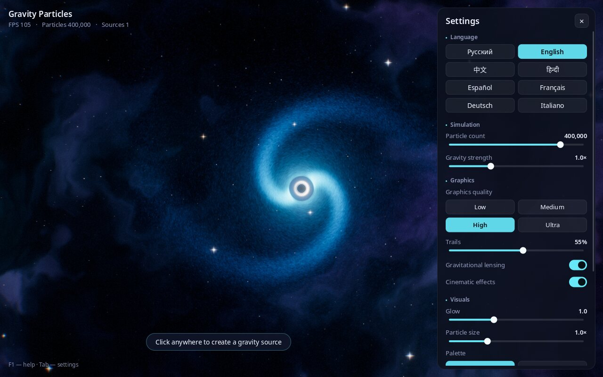

# Gravity Particles

**Model limits:** artistic OpenGL visualization with simplified dynamics,
not a relativistic black-hole model. No independent GPU/FPS benchmark is established.

[Русский](README.md) · **English** · [中文](README.zh.md) · [हिन्दी](README.hi.md) · [Español](README.es.md) · [Français](README.fr.md) · [Deutsch](README.de.md) · [Italiano](README.it.md)

**An interactive space sandbox: create black holes with a single click and watch hundreds of thousands of glowing particles swirl around them into galaxies.**


---

## What is it?

A gravity "sandbox". On screen you see space: a nebula, stars and a galaxy of hundreds of thousands of particles spinning around a black hole.

Click anywhere and a new black hole appears. It starts pulling particles in, a galaxy of its own forms around it, and neighbouring galaxies begin to interact. Press Space and everything blasts apart like a supernova — then gravity gathers the particles back together.

You don't need to know anything about physics or programming. Just watch and experiment: change the colours, the strength of gravity, the number of particles. Great for relaxing, as a backdrop on a big screen, for astronomy lessons and for kids.

## What it can do

- Configurations up to one million particles; smoothness and FPS depend on hardware and settings.
- **Black-hole visual effects**: a black event horizon, a glowing ring around it and space bending around it (like in the film "Interstellar").
- **Galaxies with spiral arms** that form on their own.
- **Beautiful effects like in modern games**: glow, light trails behind particles, smooth brightness adaptation, shockwaves on explosions.
- **4 colour palettes**: Cosmic, Neon, Rainbow, Fire.
- **Graphics quality presets** — from "Low" for simple laptops to "Ultra" for powerful computers.
- **Interface in 8 languages**: Russian, English, Chinese, Hindi, Spanish, French, German, Italian. The language is picked automatically from your system and can be changed at any time.
- **Screenshots** with one key (F12) — ready-made desktop wallpapers.
- **Settings are remembered** between launches.

| Several black holes and a shockwave | Supernova explosion |
|---|---|
|  |  |

**Palettes:** Cosmic, Neon, Rainbow, Fire


## How to install and run

### Linux (Ubuntu, Debian, Mint, Fedora, Arch, openSUSE)

1. Download the program. Open a **Terminal** (on Ubuntu: `Ctrl` + `Alt` + `T`) and paste:
   ```bash
   git clone https://github.com/Anton-Sergeev-EA/gravity-particles.git
   ```
   If `git` is not found, click the green **Code → Download ZIP** button on this page and unpack the archive.
2. Run the installer with one command:
   ```bash
   cd gravity-particles
   ./scripts/install-linux.sh
   ```
   It will ask for your administrator password to install the required system components, then build and install the program. This takes about a minute.
3. Done! Find **"Gravity Particles"** in your applications menu.

To uninstall: `./scripts/install-linux.sh --uninstall`.

### Windows and macOS

There are no ready-made installers for Windows and macOS yet. You can build the program yourself — see "For developers" below.

### System requirements

- Linux, Windows 10/11 or macOS.
- A graphics card from roughly the last 10 years (OpenGL 3.3). Built-in laptop graphics are enough for the "Low" or "Medium" quality.

## Controls

| What to do | How |
|---|---|
| Create a black hole | Left click |
| Drag a black hole | Hold the left button and move the mouse |
| Remove all black holes except the central one | Right click |
| Supernova explosion | Space |
| Change the colour palette | `C` |
| Pause / resume | `P` |
| Show / hide the settings panel | `Tab` |
| Change language | `L` |
| Save a screenshot | `F12` |
| Fullscreen / window | `F11` |
| Help | `F1` |
| Quit | `Esc` |



## What the settings mean

The panel on the right opens and closes with `Tab`.

- **Language** — interface language.
- **Particle count** — how much "star dust" is on screen. More looks better but is heavier for the computer.
- **Gravity strength** — how strongly black holes pull particles.
- **Graphics quality** — presets: Low, Medium, High, Ultra. If the program stutters, pick a lower one.
- **Trails** — length of the glowing traces behind particles. 0% — no trails.
- **Gravitational lensing** — space bending around black holes.
- **Cinematic effects** — slight darkening at the edges, film grain, subtle colour fringing at the edges of the frame and camera shake on explosions.
- **Glow** — how strongly bright areas shine.
- **Particle size** — thickness of particles.
- **Palette** — colour scheme.
- **Restore defaults** — put everything back.

Screenshots (F12) are saved to "Pictures / Gravity Particles".

## If something doesn't work

- **The program stutters.** Open the settings (`Tab`), choose "Low" or "Medium" quality and shorten the trails.
- **Black screen or the program won't start.** Your graphics card or driver probably doesn't support OpenGL 3.3 — update the graphics driver. In virtual machines without GPU access the program is very slow.
- **Found a bug or have an idea?** Write to the author (contacts below) or open an [issue](https://github.com/Anton-Sergeev-EA/gravity-particles/issues).

## Author and contacts

**Anton Sergeev**

- GitHub: [Anton-Sergeev-EA](https://github.com/Anton-Sergeev-EA)
- Email: [avsergeev1981@gmail.com](mailto:avsergeev1981@gmail.com) · [kavery@mail.ru](mailto:kavery@mail.ru)

Feel free to write: suggestions, bug reports, translations into new languages, collaboration.

---

## For developers

<details>
<summary><b>Manual build, options, architecture, tests</b></summary>

### Technologies

C++17, OpenGL 3.3 Core, GLFW, GLEW, FreeType, HarfBuzz, CMake. Noto fonts are bundled.

### Building

```bash
# Ubuntu / Debian
sudo apt install build-essential cmake libglfw3-dev libglew-dev libfreetype-dev libharfbuzz-dev
# Fedora:  sudo dnf install gcc-c++ cmake glfw-devel glew-devel freetype-devel harfbuzz-devel
# Arch:    sudo pacman -S base-devel cmake glfw glew freetype2 harfbuzz
# macOS:   brew install cmake glfw glew freetype harfbuzz
# Windows: vcpkg install glfw3 glew freetype harfbuzz
#          (then cmake with -DCMAKE_TOOLCHAIN_FILE=<vcpkg>/scripts/buildsystems/vcpkg.cmake)

cmake -S . -B build -DCMAKE_BUILD_TYPE=Release
cmake --build build -j
ctest --test-dir build --output-on-failure
./build/gravity_particles
```

Shaders, translations and fonts are copied next to the executable on every build; if that copy is incomplete, the program falls back to the source tree. System install: `cmake --install build`.

### Command-line options

```text
--lang <code>        interface language (ru, en, zh, hi, es, fr, de, it)
--particles <N>      number of particles (5000–1000000)
--fullscreen         start in fullscreen mode
--list-languages     list available languages
--version            show version
-h, --help           help in the selected language
```

For automated tests: `--frames N` renders N frames and exits; `GP_FIXED_DT=1` forces a fixed 1/60 s time step.

### Frame pipeline

1. **GPU physics** (transform feedback): a vertex shader updates every particle, spawns new ones on orbits (exponential disk profile, logarithmic arms) and swallows those that cross the horizon.
2. **Nebula** — domain-warped fractal noise at reduced resolution.
3. **Trails** — previous frame decay + velocity-stretched particles (HDR `RGBA16F`).
4. **Scene** — nebula + colour-temperature stars + trails.
5. **Lens** — gravitational lensing, event horizons, photon rings, shockwaves.
6. **Bloom** — a 5–8 level mip chain: 13-tap downsample with Karis average, tent-filter upsample.
7. **Eye adaptation** — log-average luminance; fast towards bright, slow towards dark.
8. **Final** — ACES, colour grading, chromatic aberration, vignette, grain, camera shake; UI on top.

### Project layout

```text
include/ src/
  App              window, input, main loop, render pipeline, UI
  ParticleSystem   GPU physics (transform feedback) + instanced rendering
  BloomRenderer    mip-chain bloom
  StarField        colour-temperature stars with diffraction spikes
  Shader, Framebuffer, Math
  I18n             translations, placeholders, number formats, system language
  TextShaper       HarfBuzz + FreeType shaping, font fallback, line wrapping
  UiRenderer, Ui   2D UI rendering (SDF + glyph atlas), widgets
  Settings, Paths  persisted settings, cross-platform paths
  Json, Utf8       dependency-free JSON parser and UTF-8
shaders/  locales/  assets/fonts/  scripts/  tools/  tests/  packaging/
```

The OpenGL-free core (`gp_core`) is covered by unit tests: translation completeness, glyph coverage for every character, Hindi and Chinese shaping, number formats, settings.

To add a language see [docs/TRANSLATING.md](docs/TRANSLATING.md). Changes: [CHANGELOG.md](CHANGELOG.md).

</details>

## License

Free software under the MIT license ([LICENSE](LICENSE)): use, modify and share it. Noto fonts — SIL Open Font License 1.1 ([assets/fonts/OFL.txt](assets/fonts/OFL.txt)); `stb_image_write` — public domain.
