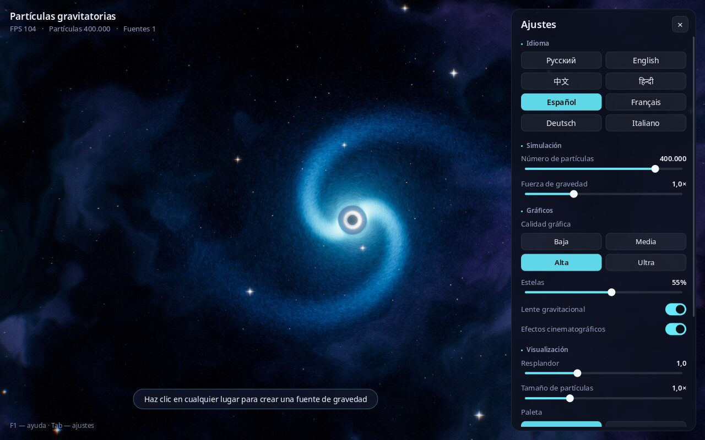

# Partículas gravitatorias

**Límites:** visualización artística OpenGL con dinámica simplificada;
no es un modelo relativista y no hay un benchmark GPU/FPS independiente.

[Русский](README.md) · [English](README.en.md) · [中文](README.zh.md) · [हिन्दी](README.hi.md) · **Español** · [Français](README.fr.md) · [Deutsch](README.de.md) · [Italiano](README.it.md)

**Un arenero espacial interactivo: crea agujeros negros con un solo clic y mira cómo cientos de miles de partículas luminosas giran a su alrededor formando galaxias.**


---

## ¿Qué es?

Es un programa tipo «arenero» sobre la gravedad. En la pantalla ves el espacio: una nebulosa, estrellas y una galaxia de cientos de miles de partículas que gira alrededor de un agujero negro.

Haz clic en cualquier lugar y aparecerá un nuevo agujero negro. Empezará a atraer partículas, a su alrededor se formará su propia galaxia y las galaxias vecinas empezarán a interactuar. Pulsa la barra espaciadora y todo saldrá despedido como en una supernova; después, la gravedad volverá a reunir las partículas.

No hace falta saber nada de física ni de programación. Basta con mirar y experimentar: cambia los colores, la fuerza de la gravedad, el número de partículas. Ideal para relajarse, como fondo en una pantalla grande, para clases de astronomía y para niños.

## Qué puede hacer

- Configuraciones de hasta un millón de partículas; los FPS dependen del hardware y los ajustes.
- **Efectos visuales de agujeros negros**: un horizonte de sucesos negro, un anillo luminoso a su alrededor y el espacio que se curva (como en la película «Interstellar»).
- **Galaxias con brazos espirales** que se forman solas.
- **Efectos espectaculares como en los videojuegos modernos**: resplandor, estelas luminosas tras las partículas, ajuste suave del brillo, ondas de choque en las explosiones.
- **4 paletas de colores**: Cosmos, Neón, Arcoíris, Fuego.
- **Ajustes de calidad gráfica**, desde «Baja» para portátiles sencillos hasta «Ultra» para ordenadores potentes.
- **Interfaz en 8 idiomas**: ruso, inglés, chino, hindi, español, francés, alemán e italiano. El idioma se elige automáticamente según el del sistema y puede cambiarse en cualquier momento.
- **Capturas de pantalla** con una sola tecla (F12): fondos de escritorio listos para usar.
- **Los ajustes se recuerdan** entre sesiones.

| Varios agujeros negros y una onda de choque | Explosión de supernova |
|---|---|
|  |  |

**Paletas:** Cosmos, Neón, Arcoíris, Fuego


## Cómo instalar y ejecutar

### Linux (Ubuntu, Debian, Mint, Fedora, Arch, openSUSE)

1. Descarga el programa. Abre una **Terminal** (en Ubuntu: `Ctrl` + `Alt` + `T`) y pega:
   ```bash
   git clone https://github.com/Anton-Sergeev-EA/gravity-particles.git
   ```
   Si no se encuentra el comando `git`, pulsa el botón verde **Code → Download ZIP** de esta página y descomprime el archivo.
2. Instala con un solo comando:
   ```bash
   cd gravity-particles
   ./scripts/install-linux.sh
   ```
   Te pedirá la contraseña de administrador para instalar los componentes del sistema necesarios; después compilará e instalará el programa. Tarda alrededor de un minuto.
3. ¡Listo! Busca **«Partículas gravitatorias»** en el menú de aplicaciones.

Para desinstalar: `./scripts/install-linux.sh --uninstall`.

### Windows y macOS

Todavía no hay instaladores listos para Windows y macOS. Puedes compilar el programa tú mismo: consulta «Para desarrolladores» más abajo.

### Requisitos

- Linux, Windows 10/11 o macOS.
- Una tarjeta gráfica de los últimos 10 años aproximadamente (OpenGL 3.3). La gráfica integrada de un portátil basta para la calidad «Baja» o «Media».

## Controles

| Qué hacer | Cómo |
|---|---|
| Crear un agujero negro | Clic izquierdo |
| Arrastrar un agujero negro | Mantén pulsado el botón izquierdo y mueve el ratón |
| Quitar todos los agujeros negros salvo el central | Clic derecho |
| Explosión de supernova | Barra espaciadora |
| Cambiar la paleta de colores | `C` |
| Pausa / reanudar | `P` |
| Mostrar / ocultar el panel de ajustes | `Tab` |
| Cambiar de idioma | `L` |
| Guardar una captura | `F12` |
| Pantalla completa / ventana | `F11` |
| Ayuda | `F1` |
| Salir | `Esc` |



## Qué significan los ajustes

El panel de la derecha se abre y se cierra con `Tab`.

- **Idioma**: idioma de la interfaz.
- **Número de partículas**: cuánto «polvo de estrellas» hay en pantalla. Más es más bonito, pero más exigente para el ordenador.
- **Fuerza de gravedad**: con qué fuerza atraen los agujeros negros a las partículas.
- **Calidad gráfica**: Baja, Media, Alta, Ultra. Si el programa va a tirones, elige una más baja.
- **Estelas**: longitud de los rastros luminosos de las partículas. 0 %: sin estelas.
- **Lente gravitacional**: curvatura del espacio alrededor de los agujeros negros.
- **Efectos cinematográficos**: ligero oscurecimiento en los bordes, grano de película, una sutil franja de color en los bordes de la imagen y vibración de la cámara en las explosiones.
- **Resplandor**: intensidad del brillo de las zonas luminosas.
- **Tamaño de partículas**: grosor de las partículas.
- **Paleta**: esquema de colores.
- **Restablecer ajustes**: volver a la configuración inicial.

Las capturas (F12) se guardan en «Imágenes / Gravity Particles».

## Si algo no funciona

- **El programa va a tirones.** Abre los ajustes (`Tab`), elige la calidad «Baja» o «Media» y acorta las estelas.
- **Pantalla negra o el programa no arranca.** Probablemente la tarjeta gráfica o el controlador no admiten OpenGL 3.3: actualiza el controlador gráfico. En máquinas virtuales sin acceso a la tarjeta gráfica el programa funciona muy lento.
- **¿Has encontrado un error o tienes una idea?** Escribe al autor (contactos abajo) o abre una incidencia en [Issues](https://github.com/Anton-Sergeev-EA/gravity-particles/issues).

## Autor y contacto

**Antón Serguéyev (Anton Sergeev)**

- GitHub: [Anton-Sergeev-EA](https://github.com/Anton-Sergeev-EA)
- Correo: [avsergeev1981@gmail.com](mailto:avsergeev1981@gmail.com) · [kavery@mail.ru](mailto:kavery@mail.ru)

Escribe sin problema: sugerencias, errores, traducciones a nuevos idiomas, colaboración.

---

## Para desarrolladores

Tecnologías: C++17, OpenGL 3.3 Core, GLFW, GLEW, FreeType, HarfBuzz, CMake.

```bash
# Ubuntu / Debian
sudo apt install build-essential cmake libglfw3-dev libglew-dev libfreetype-dev libharfbuzz-dev
cmake -S . -B build -DCMAKE_BUILD_TYPE=Release
cmake --build build -j
ctest --test-dir build --output-on-failure
./build/gravity_particles --lang es
```

Dependencias para otros sistemas, opciones de línea de comandos, el proceso de renderizado y la estructura del proyecto se describen en [README.en.md](README.en.md#for-developers). Añadir un idioma: [docs/TRANSLATING.md](docs/TRANSLATING.md).

## Licencia

Software libre con licencia MIT ([LICENSE](LICENSE)): puedes usarlo, modificarlo y compartirlo. Fuentes Noto: SIL Open Font License 1.1 ([assets/fonts/OFL.txt](assets/fonts/OFL.txt)); `stb_image_write`: dominio público.
