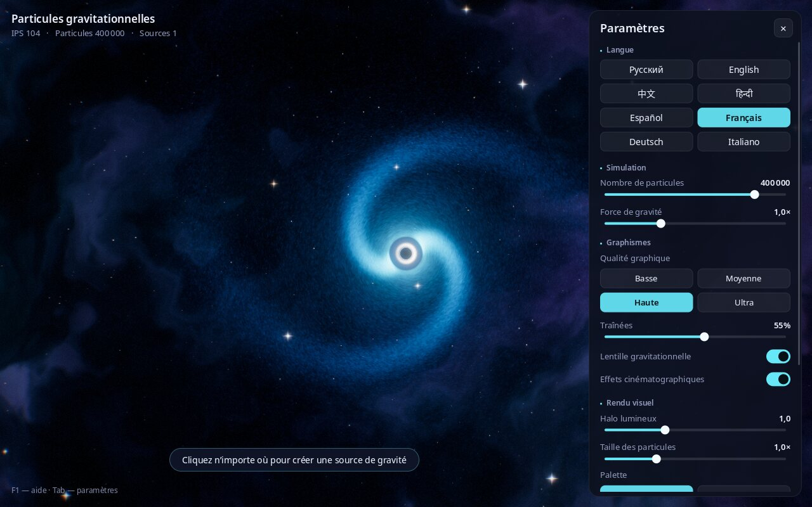

# Particules gravitationnelles

**Limites:** visualisation artistique OpenGL à dynamique simplifiée;
pas de modèle relativiste ni de benchmark GPU/FPS indépendant.

[Русский](README.md) · [English](README.en.md) · [中文](README.zh.md) · [हिन्दी](README.hi.md) · [Español](README.es.md) · **Français** · [Deutsch](README.de.md) · [Italiano](README.it.md)

**Un bac à sable spatial interactif : créez des trous noirs d’un simple clic et regardez des centaines de milliers de particules lumineuses tourbillonner autour d’eux pour former des galaxies.**


---

## Qu’est-ce que c’est ?

Un programme « bac à sable » sur la gravité. À l’écran : l’espace, avec une nébuleuse, des étoiles et une galaxie de centaines de milliers de particules qui tourne autour d’un trou noir.

Cliquez n’importe où : un nouveau trou noir apparaît. Il attire les particules, sa propre galaxie se forme autour de lui et les galaxies voisines commencent à interagir. Appuyez sur Espace : tout est projeté comme lors d’une supernova, puis la gravité rassemble à nouveau les particules.

Inutile de connaître la physique ou la programmation. Il suffit de regarder et d’expérimenter : changez les couleurs, la force de la gravité, le nombre de particules. Idéal pour se détendre, comme fond d’écran sur un grand écran, pour les cours d’astronomie et pour les enfants.

## Ce que fait le programme

- Configurations jusqu’à un million de particules; les FPS dépendent du matériel et des réglages.
- **Effets visuels de trous noirs** : un horizon des événements noir, un anneau lumineux autour et l’espace qui se courbe (comme dans le film « Interstellar »).
- **Des galaxies à bras spiraux** qui se forment d’elles-mêmes.
- **De beaux effets dignes des jeux vidéo modernes** : halo lumineux, traînées lumineuses derrière les particules, adaptation douce de la luminosité, ondes de choc lors des explosions.
- **4 palettes de couleurs** : Cosmos, Néon, Arc-en-ciel, Feu.
- **Préréglages de qualité graphique**, de « Basse » pour les ordinateurs portables modestes à « Ultra » pour les machines puissantes.
- **Interface en 8 langues** : russe, anglais, chinois, hindi, espagnol, français, allemand, italien. La langue est choisie automatiquement selon celle du système et peut être changée à tout moment.
- **Captures d’écran** en une touche (F12) : des fonds d’écran prêts à l’emploi.
- **Les réglages sont mémorisés** d’une session à l’autre.

| Plusieurs trous noirs et une onde de choc | Explosion de supernova |
|---|---|
|  |  |

**Palettes :** Cosmos, Néon, Arc-en-ciel, Feu


## Installation et lancement

### Linux (Ubuntu, Debian, Mint, Fedora, Arch, openSUSE)

1. Téléchargez le programme. Ouvrez un **Terminal** (sous Ubuntu : `Ctrl` + `Alt` + `T`) et collez :
   ```bash
   git clone https://github.com/Anton-Sergeev-EA/gravity-particles.git
   ```
   Si la commande `git` est introuvable, cliquez sur le bouton vert **Code → Download ZIP** de cette page et décompressez l’archive.
2. Installez avec une seule commande :
   ```bash
   cd gravity-particles
   ./scripts/install-linux.sh
   ```
   Le mot de passe administrateur vous sera demandé pour installer les composants système nécessaires ; le programme sera ensuite compilé et installé. Comptez environ une minute.
3. C’est prêt ! Cherchez **« Particules gravitationnelles »** dans le menu des applications.

Pour désinstaller : `./scripts/install-linux.sh --uninstall`.

### Windows et macOS

Il n’existe pas encore d’installateur prêt à l’emploi pour Windows et macOS. Vous pouvez compiler le programme vous-même : voir « Pour les développeurs » ci-dessous.

### Configuration requise

- Linux, Windows 10/11 ou macOS.
- Une carte graphique datant d’une dizaine d’années au plus (OpenGL 3.3). La puce graphique intégrée d’un portable suffit pour la qualité « Basse » ou « Moyenne ».

## Commandes

| Action | Comment |
|---|---|
| Créer un trou noir | Clic gauche |
| Déplacer un trou noir | Maintenir le bouton gauche et déplacer la souris |
| Supprimer tous les trous noirs sauf celui du centre | Clic droit |
| Explosion de supernova | Espace |
| Changer de palette | `C` |
| Pause / reprise | `P` |
| Afficher / masquer le panneau des paramètres | `Tab` |
| Changer de langue | `L` |
| Enregistrer une capture d’écran | `F12` |
| Plein écran / fenêtre | `F11` |
| Aide | `F1` |
| Quitter | `Échap` |



## Signification des paramètres

Le panneau de droite s’ouvre et se ferme avec `Tab`.

- **Langue** : langue de l’interface.
- **Nombre de particules** : quantité de « poussière d’étoiles » à l’écran. Plus il y en a, plus c’est beau, mais plus l’ordinateur travaille.
- **Force de gravité** : intensité de l’attraction des trous noirs.
- **Qualité graphique** : Basse, Moyenne, Haute, Ultra. Si le programme saccade, choisissez une qualité plus basse.
- **Traînées** : longueur des traces lumineuses derrière les particules. 0 % : pas de traînées.
- **Lentille gravitationnelle** : courbure de l’espace autour des trous noirs.
- **Effets cinématographiques** : léger assombrissement des bords, grain de film, discrète frange colorée sur les bords de l’image et tremblement de la caméra lors des explosions.
- **Halo lumineux** : intensité de l’éclat des zones brillantes.
- **Taille des particules** : épaisseur des particules.
- **Palette** : jeu de couleurs.
- **Paramètres par défaut** : tout remettre comme au départ.

Les captures (F12) sont enregistrées dans « Images / Gravity Particles ».

## En cas de problème

- **Le programme saccade.** Ouvrez les paramètres (`Tab`), choisissez la qualité « Basse » ou « Moyenne » et raccourcissez les traînées.
- **Écran noir ou le programme ne démarre pas.** La carte graphique ou son pilote ne prend probablement pas en charge OpenGL 3.3 : mettez à jour le pilote graphique. Dans une machine virtuelle sans accès à la carte graphique, le programme est très lent.
- **Un bug ou une idée ?** Écrivez à l’auteur (contacts ci-dessous) ou ouvrez un ticket sur la page [Issues](https://github.com/Anton-Sergeev-EA/gravity-particles/issues).

## Auteur et contact

**Anton Sergueïev (Anton Sergeev)**

- GitHub : [Anton-Sergeev-EA](https://github.com/Anton-Sergeev-EA)
- E-mail : [avsergeev1981@gmail.com](mailto:avsergeev1981@gmail.com) · [kavery@mail.ru](mailto:kavery@mail.ru)

N’hésitez pas à écrire : suggestions, signalements de bugs, traductions dans de nouvelles langues, collaboration.

---

## Pour les développeurs

Technologies : C++17, OpenGL 3.3 Core, GLFW, GLEW, FreeType, HarfBuzz, CMake.

```bash
# Ubuntu / Debian
sudo apt install build-essential cmake libglfw3-dev libglew-dev libfreetype-dev libharfbuzz-dev
cmake -S . -B build -DCMAKE_BUILD_TYPE=Release
cmake --build build -j
ctest --test-dir build --output-on-failure
./build/gravity_particles --lang fr
```

Les dépendances pour les autres systèmes, les options de ligne de commande, la chaîne de rendu et la structure du projet sont décrites dans [README.en.md](README.en.md#for-developers). Ajouter une langue : [docs/TRANSLATING.md](docs/TRANSLATING.md).

## Licence

Logiciel libre sous licence MIT ([LICENSE](LICENSE)) : vous pouvez l’utiliser, le modifier et le partager. Polices Noto : SIL Open Font License 1.1 ([assets/fonts/OFL.txt](assets/fonts/OFL.txt)) ; `stb_image_write` : domaine public.
