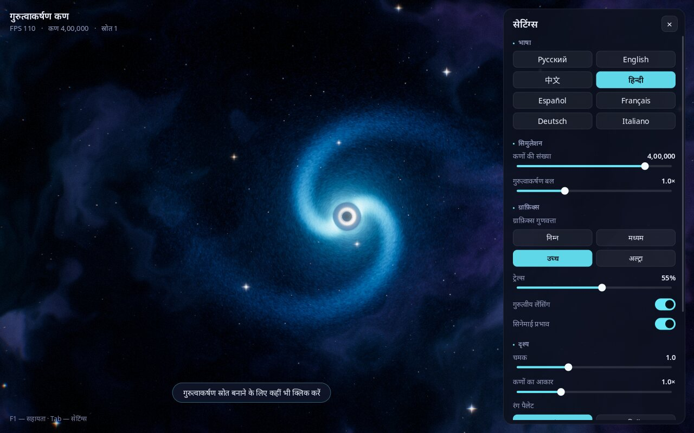

# गुरुत्वाकर्षण कण

**सीमाएँ:** सरल गतिकी वाला कलात्मक OpenGL दृश्य; यह सापेक्षिक ब्लैक होल मॉडल नहीं है।
स्वतंत्र GPU/FPS बेंचमार्क स्थापित नहीं है।

[Русский](README.md) · [English](README.en.md) · [中文](README.zh.md) · **हिन्दी** · [Español](README.es.md) · [Français](README.fr.md) · [Deutsch](README.de.md) · [Italiano](README.it.md)

**एक इंटरैक्टिव अंतरिक्ष सैंडबॉक्स: एक क्लिक से ब्लैक होल बनाइए और देखिए कि लाखों चमकते कण उनके चारों ओर घूमकर आकाशगंगाएँ कैसे बनाते हैं।**


---

## यह क्या है?

यह गुरुत्वाकर्षण के बारे में एक "सैंडबॉक्स" प्रोग्राम है। स्क्रीन पर अंतरिक्ष दिखता है: नीहारिका, तारे और लाखों कणों से बनी एक आकाशगंगा, जो एक ब्लैक होल के चारों ओर घूमती है।

कहीं भी क्लिक कीजिए — वहाँ एक नया ब्लैक होल बन जाएगा। वह कणों को अपनी ओर खींचने लगेगा, उसके चारों ओर उसकी अपनी आकाशगंगा बन जाएगी, और पास की आकाशगंगाएँ एक-दूसरे को प्रभावित करने लगेंगी। स्पेस दबाइए — सब कुछ सुपरनोवा विस्फोट की तरह बिखर जाएगा, और फिर गुरुत्वाकर्षण कणों को दोबारा इकट्ठा कर लेगा।

इसके लिए भौतिकी या प्रोग्रामिंग जानने की ज़रूरत नहीं है। बस देखिए और प्रयोग कीजिए: रंग, गुरुत्वाकर्षण की ताकत और कणों की संख्या बदलिए। यह आराम के लिए, बड़ी स्क्रीन पर पृष्ठभूमि के रूप में, खगोल विज्ञान की कक्षाओं के लिए और बच्चों के लिए उपयुक्त है।

## प्रोग्राम क्या कर सकता है

- दस लाख तक कणों का विन्यास; FPS हार्डवेयर और सेटिंग पर निर्भर है।
- **ब्लैक होल के दृश्य प्रभाव**: काला घटना क्षितिज, उसके चारों ओर चमकती अंगूठी और आसपास के स्थान का मुड़ना (जैसे फ़िल्म "इंटरस्टेलर" में)।
- **सर्पिल भुजाओं वाली आकाशगंगाएँ**, जो अपने आप बनती हैं।
- **आधुनिक खेलों जैसे सुंदर प्रभाव**: चमक, कणों के पीछे चमकती लकीरें, चमक का सहज समायोजन, विस्फोट पर आघात तरंगें।
- **4 रंग पैलेट**: ब्रह्मांड, नियॉन, इंद्रधनुष, अग्नि।
- **ग्राफ़िक्स गुणवत्ता के विकल्प** — साधारण लैपटॉप के लिए "निम्न" से लेकर शक्तिशाली कंप्यूटर के लिए "अल्ट्रा" तक।
- **8 भाषाओं में इंटरफ़ेस**: रूसी, अंग्रेज़ी, चीनी, हिन्दी, स्पेनिश, फ़्रेंच, जर्मन, इतालवी। भाषा सिस्टम की भाषा के अनुसार अपने आप चुनी जाती है और कभी भी बदली जा सकती है।
- **एक कुंजी से स्क्रीनशॉट** (F12) — डेस्कटॉप के लिए तैयार वॉलपेपर।
- **सेटिंग्स याद रहती हैं** — अगली बार खोलने पर भी।

| कई ब्लैक होल और आघात तरंग | सुपरनोवा विस्फोट |
|---|---|
|  |  |

**पैलेट:** ब्रह्मांड, नियॉन, इंद्रधनुष, अग्नि


## इंस्टॉल करना और चलाना

### Linux (Ubuntu, Debian, Mint, Fedora, Arch, openSUSE)

1. प्रोग्राम डाउनलोड कीजिए। **टर्मिनल** खोलिए (Ubuntu में `Ctrl` + `Alt` + `T`) और यह कमांड चिपकाइए:
   ```bash
   git clone https://github.com/Anton-Sergeev-EA/gravity-particles.git
   ```
   अगर `git` कमांड नहीं मिलती, तो इस पेज पर हरे बटन **Code → Download ZIP** पर क्लिक करके आर्काइव को अनज़िप कीजिए।
2. एक ही कमांड से इंस्टॉल कीजिए:
   ```bash
   cd gravity-particles
   ./scripts/install-linux.sh
   ```
   प्रोग्राम ज़रूरी सिस्टम घटक इंस्टॉल करने के लिए व्यवस्थापक (एडमिन) पासवर्ड माँगेगा, फिर अपने आप बनकर इंस्टॉल हो जाएगा। इसमें लगभग एक मिनट लगता है।
3. हो गया! ऐप्लिकेशन मेनू में **"गुरुत्वाकर्षण कण"** खोजिए।

हटाने के लिए: `./scripts/install-linux.sh --uninstall`।

### Windows और macOS

Windows और macOS के लिए अभी तैयार इंस्टॉलर नहीं हैं। प्रोग्राम को आप खुद बना सकते हैं — नीचे "डेवलपर्स के लिए" देखिए।

### कंप्यूटर की ज़रूरतें

- Linux, Windows 10/11 या macOS।
- पिछले लगभग 10 वर्षों का ग्राफ़िक्स कार्ड (OpenGL 3.3 सपोर्ट)। "निम्न" या "मध्यम" गुणवत्ता के लिए लैपटॉप का बिल्ट-इन ग्राफ़िक्स काफ़ी है।

## नियंत्रण

| क्या करना है | कैसे |
|---|---|
| ब्लैक होल बनाना | बायाँ क्लिक |
| ब्लैक होल खिसकाना | बायाँ बटन दबाए रखकर माउस चलाइए |
| बीच वाले को छोड़कर सभी ब्लैक होल हटाना | दायाँ क्लिक |
| सुपरनोवा विस्फोट | स्पेस |
| रंग पैलेट बदलना | `C` |
| रोकें / जारी रखें | `P` |
| सेटिंग्स पैनल दिखाएँ / छिपाएँ | `Tab` |
| भाषा बदलना | `L` |
| स्क्रीनशॉट सहेजना | `F12` |
| पूर्ण स्क्रीन / विंडो | `F11` |
| सहायता | `F1` |
| बाहर निकलना | `Esc` |



## सेटिंग्स का अर्थ

दाईं ओर का पैनल `Tab` से खुलता और बंद होता है।

- **भाषा** — इंटरफ़ेस की भाषा।
- **कणों की संख्या** — स्क्रीन पर कितनी "तारकीय धूल" है। ज़्यादा कण ज़्यादा सुंदर हैं, पर कंप्यूटर पर भार भी बढ़ता है।
- **गुरुत्वाकर्षण बल** — ब्लैक होल कणों को कितनी ताकत से खींचते हैं।
- **ग्राफ़िक्स गुणवत्ता** — तैयार विकल्प: निम्न, मध्यम, उच्च, अल्ट्रा। अगर प्रोग्राम अटकता है, तो कम गुणवत्ता चुनिए।
- **ट्रेल्स** — कणों के पीछे चमकती लकीरों की लंबाई। 0% — कोई लकीर नहीं।
- **गुरुत्वीय लेंसिंग** — ब्लैक होल के चारों ओर स्थान का मुड़ना।
- **सिनेमाई प्रभाव** — किनारों पर हल्का अँधेरा, फ़िल्म जैसा दानेदारपन, फ़्रेम के किनारों पर हल्का रंगीन धुंधलापन और विस्फोट पर कैमरे का हिलना।
- **चमक** — चमकीले हिस्सों की चमक की ताकत।
- **कणों का आकार** — कणों की मोटाई।
- **रंग पैलेट** — रंग योजना।
- **डिफ़ॉल्ट सेटिंग्स** — सब कुछ पहले जैसा कर देना।

स्क्रीनशॉट (F12) "Pictures / Gravity Particles" फ़ोल्डर में सहेजे जाते हैं।

## अगर कुछ काम न करे

- **प्रोग्राम अटकता है।** सेटिंग्स खोलिए (`Tab`), "निम्न" या "मध्यम" गुणवत्ता चुनिए और ट्रेल्स कम कीजिए।
- **काली स्क्रीन या प्रोग्राम शुरू नहीं होता।** संभवतः आपका ग्राफ़िक्स कार्ड या ड्राइवर OpenGL 3.3 सपोर्ट नहीं करता — ग्राफ़िक्स ड्राइवर अपडेट कीजिए। ग्राफ़िक्स कार्ड तक पहुँच के बिना वर्चुअल मशीनों में प्रोग्राम बहुत धीरे चलता है।
- **कोई गड़बड़ी मिली या कोई सुझाव है?** लेखक को लिखिए (संपर्क नीचे) या [Issues](https://github.com/Anton-Sergeev-EA/gravity-particles/issues) पेज पर दर्ज कीजिए।

## लेखक और संपर्क

**एंटन सर्गेयेव (Anton Sergeev)**

- GitHub: [Anton-Sergeev-EA](https://github.com/Anton-Sergeev-EA)
- ईमेल: [avsergeev1981@gmail.com](mailto:avsergeev1981@gmail.com) · [kavery@mail.ru](mailto:kavery@mail.ru)

बेझिझक लिखिए: सुझाव, गड़बड़ियों की सूचना, नई भाषाओं में अनुवाद, सहयोग।

---

## डेवलपर्स के लिए

तकनीकें: C++17, OpenGL 3.3 Core, GLFW, GLEW, FreeType, HarfBuzz, CMake।

```bash
# Ubuntu / Debian
sudo apt install build-essential cmake libglfw3-dev libglew-dev libfreetype-dev libharfbuzz-dev
cmake -S . -B build -DCMAKE_BUILD_TYPE=Release
cmake --build build -j
ctest --test-dir build --output-on-failure
./build/gravity_particles --lang hi
```

अन्य सिस्टम पर निर्भरताएँ, कमांड-लाइन विकल्प, रेंडरिंग पाइपलाइन और प्रोजेक्ट की संरचना का विस्तृत विवरण [README.en.md](README.en.md#for-developers) में है। नई भाषा जोड़ना: [docs/TRANSLATING.md](docs/TRANSLATING.md)।

## लाइसेंस

यह MIT लाइसेंस ([LICENSE](LICENSE)) के तहत मुफ़्त सॉफ़्टवेयर है: आप इसे इस्तेमाल, संशोधित और साझा कर सकते हैं। Noto फ़ॉन्ट — SIL Open Font License 1.1 ([assets/fonts/OFL.txt](assets/fonts/OFL.txt)); `stb_image_write` — सार्वजनिक डोमेन।
