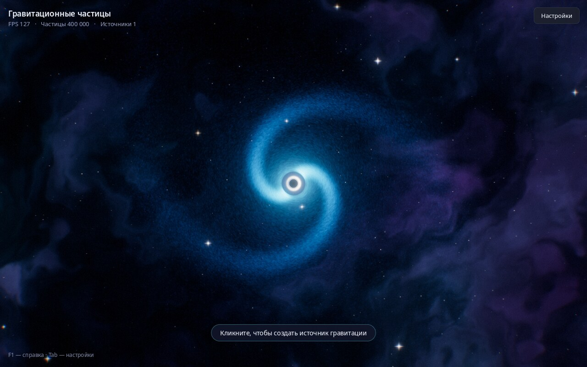
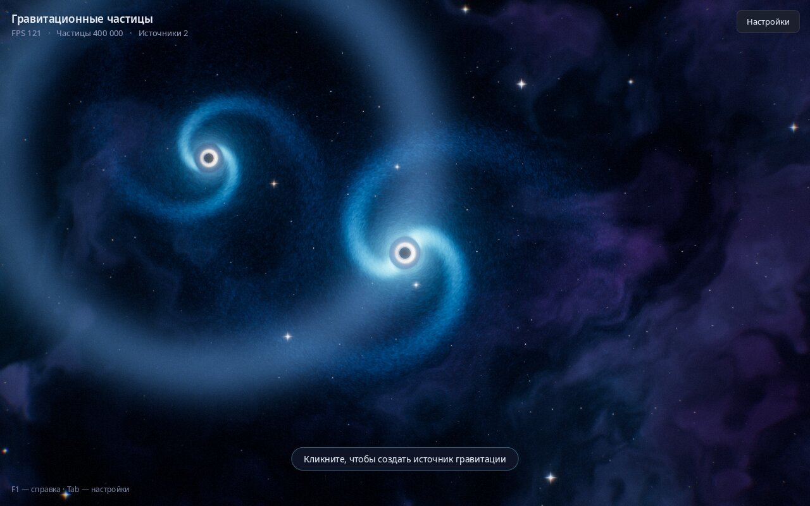
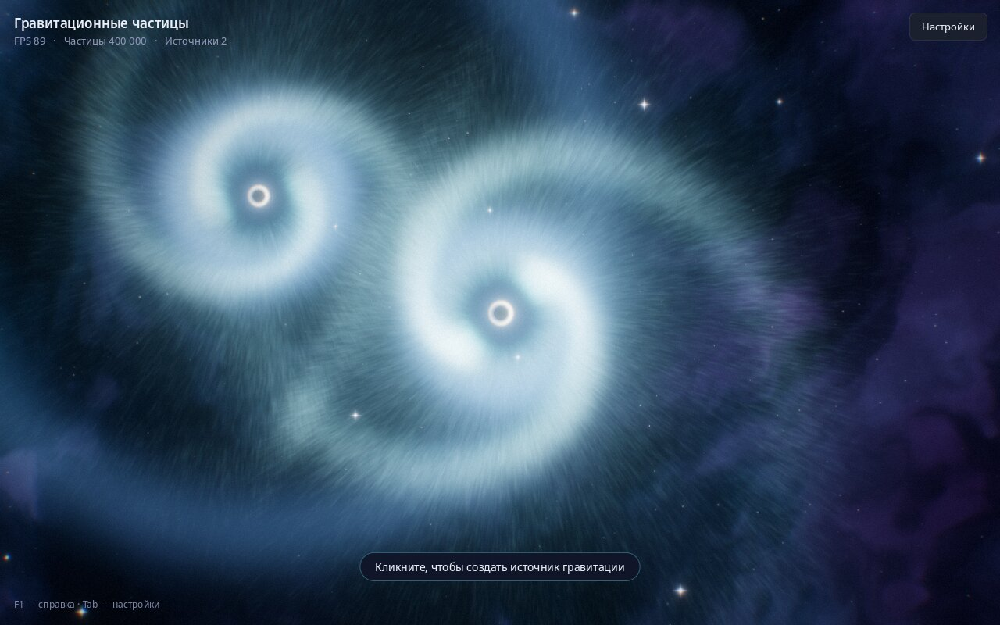
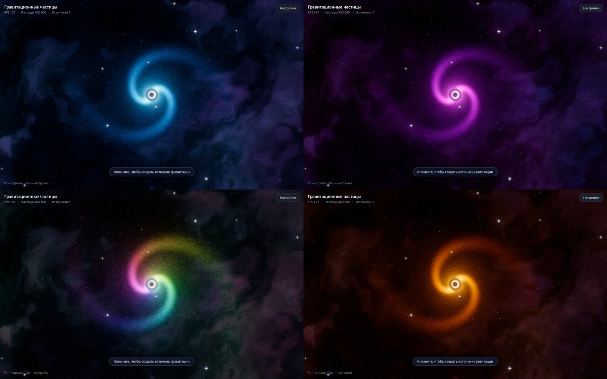
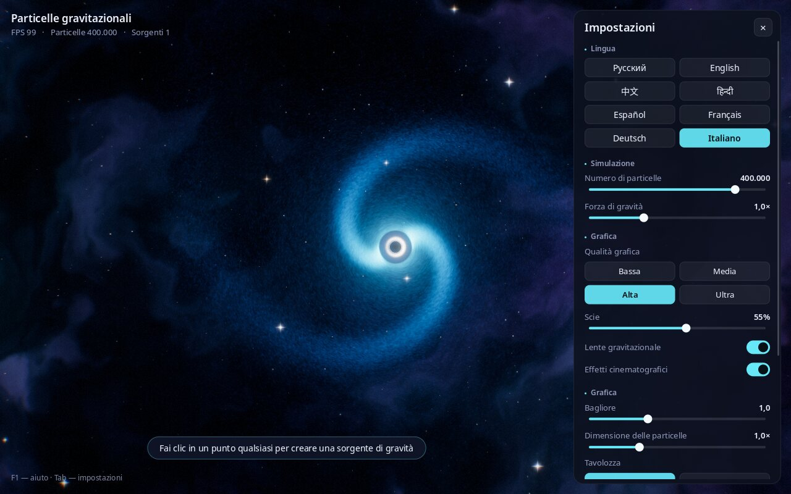

# Particelle gravitazionali

[Русский](README.md) · [English](README.en.md) · [中文](README.zh.md) · [हिन्दी](README.hi.md) · [Español](README.es.md) · [Français](README.fr.md) · [Deutsch](README.de.md) · **Italiano**

**Una sandbox spaziale interattiva: crea buchi neri con un clic e guarda centinaia di migliaia di particelle luminose vorticare intorno a loro fino a formare galassie.**



---

## Che cos’è?

È un programma «sandbox» sulla gravità. Sullo schermo c’è lo spazio: una nebulosa, le stelle e una galassia di centinaia di migliaia di particelle che ruota intorno a un buco nero.

Fai clic in un punto qualsiasi e apparirà un nuovo buco nero. Comincerà ad attirare le particelle, intorno a lui si formerà una galassia tutta sua e le galassie vicine inizieranno a interagire. Premi la barra spaziatrice e tutto esploderà come una supernova; poi la gravità radunerà di nuovo le particelle.

Non serve sapere nulla di fisica o di programmazione. Basta guardare e sperimentare: cambia i colori, la forza di gravità, il numero di particelle. Perfetto per rilassarsi, come sfondo su un grande schermo, per le lezioni di astronomia e per i bambini.

## Cosa sa fare

- **Fino a un milione di particelle contemporaneamente**, in modo fluido e in tempo reale.
- **Buchi neri realistici**: un orizzonte degli eventi nero, un anello luminoso intorno e lo spazio che si curva (come nel film «Interstellar»).
- **Galassie con bracci a spirale** che si formano da sole.
- **Effetti spettacolari come nei videogiochi moderni**: bagliore, scie luminose dietro le particelle, adattamento morbido della luminosità, onde d’urto nelle esplosioni.
- **4 tavolozze di colori**: Cosmo, Neon, Arcobaleno, Fuoco.
- **Livelli di qualità grafica**, da «Bassa» per i portatili più semplici a «Ultra» per i computer potenti.
- **Interfaccia in 8 lingue**: russo, inglese, cinese, hindi, spagnolo, francese, tedesco, italiano. La lingua viene scelta automaticamente in base a quella del sistema e si può cambiare in qualsiasi momento.
- **Screenshot** con un solo tasto (F12): sfondi per il desktop già pronti.
- **Le impostazioni vengono ricordate** tra un avvio e l’altro.

| Più buchi neri e un’onda d’urto | Esplosione di supernova |
|---|---|
|  |  |

**Tavolozze:** Cosmo, Neon, Arcobaleno, Fuoco



## Come installare e avviare

### Linux (Ubuntu, Debian, Mint, Fedora, Arch, openSUSE)

1. Scarica il programma. Apri un **Terminale** (su Ubuntu: `Ctrl` + `Alt` + `T`) e incolla:
   ```bash
   git clone https://github.com/Anton-Sergeev-EA/gravity-particles.git
   ```
   Se il comando `git` non viene trovato, premi il pulsante verde **Code → Download ZIP** in questa pagina ed estrai l’archivio.
2. Installa con un solo comando:
   ```bash
   cd gravity-particles
   ./scripts/install-linux.sh
   ```
   Ti verrà chiesta la password di amministratore per installare i componenti di sistema necessari; poi il programma verrà compilato e installato. Ci vuole circa un minuto.
3. Fatto! Cerca **«Particelle gravitazionali»** nel menu delle applicazioni.

Per disinstallare: `./scripts/install-linux.sh --uninstall`.

### Windows e macOS

Per Windows e macOS non ci sono ancora programmi di installazione pronti. Puoi compilare il programma da solo: vedi «Per gli sviluppatori» più sotto.

### Requisiti

- Linux, Windows 10/11 o macOS.
- Una scheda grafica degli ultimi 10 anni circa (OpenGL 3.3). La grafica integrata di un portatile basta per la qualità «Bassa» o «Media».

## Comandi

| Cosa fare | Come |
|---|---|
| Creare un buco nero | Clic sinistro |
| Trascinare un buco nero | Tieni premuto il tasto sinistro e muovi il mouse |
| Rimuovere tutti i buchi neri tranne quello centrale | Clic destro |
| Esplosione di supernova | Barra spaziatrice |
| Cambiare tavolozza | `C` |
| Pausa / riprendi | `P` |
| Mostrare / nascondere il pannello delle impostazioni | `Tab` |
| Cambiare lingua | `L` |
| Salvare uno screenshot | `F12` |
| Schermo intero / finestra | `F11` |
| Aiuto | `F1` |
| Uscire | `Esc` |



## Cosa significano le impostazioni

Il pannello a destra si apre e si chiude con `Tab`.

- **Lingua**: lingua dell’interfaccia.
- **Numero di particelle**: quanta «polvere di stelle» c’è sullo schermo. Di più è più bello, ma più pesante per il computer.
- **Forza di gravità**: quanto forte i buchi neri attirano le particelle.
- **Qualità grafica**: Bassa, Media, Alta, Ultra. Se il programma scatta, scegline una più bassa.
- **Scie**: lunghezza delle tracce luminose dietro le particelle. 0 %: nessuna scia.
- **Lente gravitazionale**: curvatura dello spazio intorno ai buchi neri.
- **Effetti cinematografici**: leggero oscuramento ai bordi, grana della pellicola, una sottile frangia di colore ai bordi dell’immagine e tremolio della telecamera nelle esplosioni.
- **Bagliore**: intensità della luminosità delle zone più chiare.
- **Dimensione delle particelle**: spessore delle particelle.
- **Tavolozza**: schema di colori.
- **Impostazioni predefinite**: ripristina tutto.

Gli screenshot (F12) vengono salvati in «Immagini / Gravity Particles».

## Se qualcosa non funziona

- **Il programma scatta.** Apri le impostazioni (`Tab`), scegli la qualità «Bassa» o «Media» e accorcia le scie.
- **Schermo nero o il programma non si avvia.** Probabilmente la scheda grafica o il driver non supportano OpenGL 3.3: aggiorna il driver grafico. Nelle macchine virtuali senza accesso alla scheda grafica il programma è molto lento.
- **Hai trovato un errore o hai un’idea?** Scrivi all’autore (contatti qui sotto) o apri una segnalazione nella pagina [Issues](https://github.com/Anton-Sergeev-EA/gravity-particles/issues).

## Autore e contatti

**Anton Sergeev**

- GitHub: [Anton-Sergeev-EA](https://github.com/Anton-Sergeev-EA)
- E-mail: [avsergeev1981@gmail.com](mailto:avsergeev1981@gmail.com) · [kavery@mail.ru](mailto:kavery@mail.ru)

Scrivi pure: suggerimenti, segnalazioni di errori, traduzioni in nuove lingue, collaborazioni.

---

## Per gli sviluppatori

Tecnologie: C++17, OpenGL 3.3 Core, GLFW, GLEW, FreeType, HarfBuzz, CMake.

```bash
# Ubuntu / Debian
sudo apt install build-essential cmake libglfw3-dev libglew-dev libfreetype-dev libharfbuzz-dev
cmake -S . -B build -DCMAKE_BUILD_TYPE=Release
cmake --build build -j
ctest --test-dir build --output-on-failure
./build/gravity_particles --lang it
```

Le dipendenze per gli altri sistemi, le opzioni della riga di comando, la pipeline di rendering e la struttura del progetto sono descritte in [README.en.md](README.en.md#for-developers). Aggiungere una lingua: [docs/TRANSLATING.md](docs/TRANSLATING.md).

## Licenza

Software libero con licenza MIT ([LICENSE](LICENSE)): puoi usarlo, modificarlo e condividerlo. Font Noto: SIL Open Font License 1.1 ([assets/fonts/OFL.txt](assets/fonts/OFL.txt)); `stb_image_write`: pubblico dominio.
