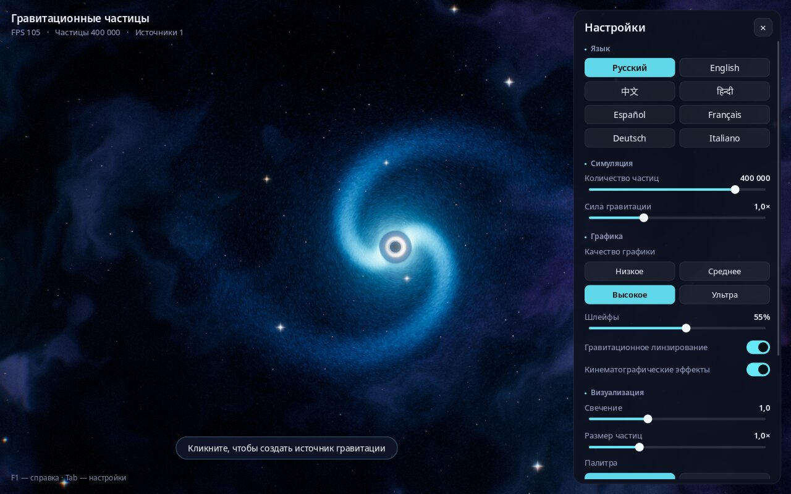

# Гравитационные частицы

**Границы модели:** художественная OpenGL-визуализация с упрощённой динамикой,
не релятивистская модель чёрных дыр. Независимый GPU/FPS benchmark не выполнен.

**Русский** · [English](README.en.md) · [中文](README.zh.md) · [हिन्दी](README.hi.md) · [Español](README.es.md) · [Français](README.fr.md) · [Deutsch](README.de.md) · [Italiano](README.it.md)

**Интерактивная космическая песочница: создавайте чёрные дыры одним щелчком мыши и смотрите, как сотни тысяч светящихся частиц закручиваются вокруг них в галактики.**


---

## Что это такое

Это программа-«песочница» про гравитацию. На экране — космос: туманность, звёзды и галактика из сотен тысяч частиц, которая вращается вокруг чёрной дыры.

Щёлкните мышью в любом месте, и там появится новая чёрная дыра. Она начнёт притягивать частицы, вокруг неё закрутится собственная галактика, а соседние галактики станут взаимодействовать между собой. Нажмите пробел, и всё разлетится, как при взрыве сверхновой, а затем гравитация снова соберёт частицы.

Здесь не нужно ничего знать о физике или программировании. Можно просто смотреть и экспериментировать: менять цвета, силу притяжения, количество частиц. Подходит для отдыха, для фона на большом экране, для уроков астрономии и для детей.

## Что умеет программа

- Конфигурации до миллиона частиц; плавность и FPS зависят от оборудования и настроек.
- **Визуальные эффекты чёрных дыр**: чёрный горизонт событий, светящееся кольцо вокруг него и искривление пространства (как в фильме «Интерстеллар»).
- **Галактики со спиральными рукавами**, которые формируются сами.
- **Красивые эффекты, как в современных играх**: свечение, светящиеся шлейфы за частицами, мягкая подстройка яркости, ударные волны при взрыве.
- **4 цветовые палитры**: «Космос», «Неон», «Радуга», «Пламя».
- **Настройка качества графики** — от «Низкого» для простых ноутбуков до «Ультра» для мощных компьютеров.
- **Интерфейс на 8 языках**: русский, английский, китайский, хинди, испанский, французский, немецкий, итальянский. Язык выбирается автоматически по языку системы, его можно сменить в любой момент.
- **Снимки экрана** одной клавишей (F12) — готовые обои для рабочего стола.
- **Настройки запоминаются** между запусками.

| Несколько чёрных дыр и ударная волна | Взрыв сверхновой |
|---|---|
|  |  |

**Палитры:** «Космос», «Неон», «Радуга», «Пламя»


## Как установить и запустить

### Linux (Ubuntu, Debian, Mint, Fedora, Arch, openSUSE)

1. Скачайте программу. Откройте **Терминал** (в Ubuntu — клавиши `Ctrl` + `Alt` + `T`) и вставьте команду:
   ```bash
   git clone https://github.com/Anton-Sergeev-EA/gravity-particles.git
   ```
   Если команда `git` не найдена, нажмите на этой странице зелёную кнопку **Code → Download ZIP** и распакуйте архив.
2. Запустите установку одной командой:
   ```bash
   cd gravity-particles
   ./scripts/install-linux.sh
   ```
   Программа попросит пароль администратора — он нужен, чтобы установить необходимые системные компоненты. Затем она соберётся и установится; это займёт около минуты.
3. Готово! Найдите **«Гравитационные частицы»** в меню приложений.

Удалить программу: `./scripts/install-linux.sh --uninstall`.

### Windows и macOS

Готовых установщиков для Windows и macOS пока нет. Программу можно собрать самостоятельно — см. раздел «Для разработчиков» ниже.

### Требования к компьютеру

- Linux, Windows 10/11 или macOS.
- Видеокарта, выпущенная примерно за последние 10 лет (поддержка OpenGL 3.3). Встроенной графики ноутбука достаточно для качества «Низкое» или «Среднее».

## Управление

| Что сделать | Как |
|---|---|
| Создать чёрную дыру | Щелчок левой кнопкой мыши |
| Перетащить чёрную дыру | Зажать левую кнопку и вести мышь |
| Убрать все чёрные дыры, кроме центральной | Щелчок правой кнопкой мыши |
| Взрыв сверхновой | Пробел |
| Сменить цветовую палитру | `C` |
| Пауза / продолжить | `P` |
| Показать / скрыть панель настроек | `Tab` |
| Сменить язык | `L` |
| Сохранить снимок экрана | `F12` |
| Во весь экран / в окне | `F11` |
| Справка | `F1` |
| Выход | `Esc` |



## Что означают настройки

Панель справа открывается и закрывается клавишей `Tab`.

- **Язык** — язык интерфейса.
- **Количество частиц** — сколько «звёздной пыли» на экране. Больше — красивее, но тяжелее для компьютера.
- **Сила гравитации** — насколько сильно чёрные дыры притягивают частицы.
- **Качество графики** — готовые наборы: «Низкое», «Среднее», «Высокое», «Ультра». Если программа подтормаживает, выберите качество пониже.
- **Шлейфы** — длина светящихся следов за частицами. 0 % — без следов.
- **Гравитационное линзирование** — искривление пространства вокруг чёрных дыр.
- **Кинематографические эффекты** — лёгкое затемнение по краям, «плёночное» зерно, едва заметное цветное размытие по краям кадра и тряска камеры при взрыве.
- **Свечение** — сила сияния ярких мест.
- **Размер частиц** — толщина частиц.
- **Палитра** — цветовая гамма.
- **Настройки по умолчанию** — вернуть всё как было.

Снимки экрана (F12) сохраняются в папку «Изображения / Gravity Particles».

## Если что-то не работает

- **Программа подтормаживает.** Откройте настройки (`Tab`), выберите качество «Низкое» или «Среднее» и уменьшите шлейфы.
- **Чёрный экран или программа не запускается.** Скорее всего, видеокарта или драйвер не поддерживают OpenGL 3.3 — обновите видеодрайвер. В виртуальных машинах без доступа к видеокарте программа работает очень медленно.
- **Нашли ошибку или есть идея?** Напишите автору (контакты ниже) или создайте обращение на странице [Issues](https://github.com/Anton-Sergeev-EA/gravity-particles/issues).

## Автор и контакты

**Антон Сергеев** (Сергеев Антон Валентинович)

- GitHub: [Anton-Sergeev-EA](https://github.com/Anton-Sergeev-EA)
- Электронная почта: [avsergeev1981@gmail.com](mailto:avsergeev1981@gmail.com) · [kavery@mail.ru](mailto:kavery@mail.ru)

Пишите: предложения, сообщения об ошибках, переводы на новые языки, сотрудничество.

---

## Для разработчиков

<details>
<summary><b>Сборка вручную, параметры, архитектура, тесты</b></summary>

### Технологии

C++17, OpenGL 3.3 Core, GLFW, GLEW, FreeType, HarfBuzz, CMake. Шрифты Noto встроены в проект.

### Сборка

```bash
# Ubuntu / Debian
sudo apt install build-essential cmake libglfw3-dev libglew-dev libfreetype-dev libharfbuzz-dev
# Fedora:  sudo dnf install gcc-c++ cmake glfw-devel glew-devel freetype-devel harfbuzz-devel
# Arch:    sudo pacman -S base-devel cmake glfw glew freetype2 harfbuzz
# macOS:   brew install cmake glfw glew freetype harfbuzz
# Windows: vcpkg install glfw3 glew freetype harfbuzz
#          (затем cmake с -DCMAKE_TOOLCHAIN_FILE=<vcpkg>/scripts/buildsystems/vcpkg.cmake)

cmake -S . -B build -DCMAKE_BUILD_TYPE=Release
cmake --build build -j
ctest --test-dir build --output-on-failure
./build/gravity_particles
```

Шейдеры, переводы и шрифты копируются рядом с исполняемым файлом при каждой сборке. Если копия неполная, программа берёт ресурсы из каталога исходников. Установка в систему: `cmake --install build` (бинарник, ресурсы в `share/gravity-particles`, ярлык в меню с переводами).

### Параметры командной строки

```text
--lang <code>        язык интерфейса (ru, en, zh, hi, es, fr, de, it)
--particles <N>      количество частиц (5000–1000000)
--fullscreen         запуск в полноэкранном режиме
--list-languages     список доступных языков
--version            версия
-h, --help           справка на выбранном языке
```

Для автотестов: `--frames N` — отрисовать N кадров и выйти; переменная `GP_FIXED_DT=1` — фиксированный шаг 1/60 с.

### Как устроен кадр

1. **Физика на видеокарте** (transform feedback): вершинный шейдер обновляет каждую частицу, рождает новые на орбитах (экспоненциальный профиль диска, логарифмические рукава) и поглощает упавшие за горизонт.
2. **Туманность** — фрактальный шум с доменным искажением, в пониженном разрешении.
3. **Шлейфы** — затухание прошлого кадра + частицы, вытянутые вдоль скорости (HDR `RGBA16F`).
4. **Сцена** — туманность + звёзды разной цветовой температуры + шлейфы.
5. **Линза** — гравитационное линзирование, горизонты, фотонные кольца, ударные волны.
6. **Bloom** — цепочка из 5–8 уровней: понижение 13-точечным фильтром со взвешиванием Кариса, повышение «шатровым» фильтром.
7. **Адаптация экспозиции** — средняя логарифмическая яркость; быстро к свету, медленно к темноте.
8. **Финал** — ACES, цветокоррекция, хроматическая аберрация, виньетка, зерно, тряска камеры; поверх — интерфейс.

### Структура проекта

```text
include/ src/
  App              окно, ввод, главный цикл, рендер-конвейер, интерфейс
  ParticleSystem   GPU-физика (transform feedback) + instanced-рендеринг
  BloomRenderer    bloom на цепочке уменьшенных буферов
  StarField        звёзды разной цветовой температуры с лучами
  Shader, Framebuffer, Math
  I18n             переводы, подстановки, форматы чисел, язык системы
  TextShaper       HarfBuzz + FreeType: шейпинг, цепочка шрифтов, перенос строк
  UiRenderer, Ui   2D-рендер интерфейса (SDF + атлас глифов), виджеты
  Settings, Paths  настройки, кроссплатформенные пути
  Json, Utf8       JSON-парсер и UTF-8 без зависимостей
shaders/           GLSL-шейдеры
locales/           languages.json + ru/en/zh/hi/es/fr/de/it.json
assets/fonts/      подмножества шрифтов Noto (OFL)
scripts/           установщик для Linux
tools/             пересборка шрифтов под переводы
tests/             модульные тесты (ctest)
packaging/         ярлык .desktop с переводами
```

Логика без OpenGL (`gp_core`: переводы, шейпинг текста, настройки) покрыта тестами: полнота переводов, покрытие всех символов шрифтами, корректность шейпинга хинди и китайского, форматы чисел, настройки.

### Переводы

Как добавить язык — [docs/TRANSLATING.md](docs/TRANSLATING.md). История изменений — [CHANGELOG.md](CHANGELOG.md).

### Где хранятся настройки

| ОС | Путь |
|---|---|
| Linux | `~/.config/gravity-particles/settings.ini` |
| macOS | `~/Library/Application Support/GravityParticles/settings.ini` |
| Windows | `%APPDATA%\GravityParticles\settings.ini` |

</details>

## Лицензия

Программа распространяется свободно по лицензии MIT ([LICENSE](LICENSE)): её можно использовать, изменять и распространять. Шрифты Noto — SIL Open Font License 1.1 ([assets/fonts/OFL.txt](assets/fonts/OFL.txt)); `stb_image_write` — общественное достояние.
