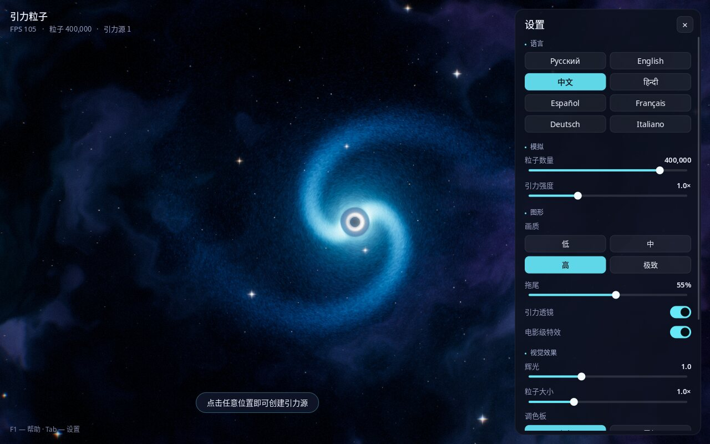

# 引力粒子

[Русский](README.md) · [English](README.en.md) · **中文** · [हिन्दी](README.hi.md) · [Español](README.es.md) · [Français](README.fr.md) · [Deutsch](README.de.md) · [Italiano](README.it.md)

**一个交互式的太空沙盒：只需点击鼠标即可创造黑洞，看着数十万颗发光粒子围绕它们旋转成星系。**


---

## 这是什么？

这是一个关于引力的“沙盒”程序。屏幕上是浩瀚的宇宙：星云、恒星，以及由数十万颗粒子组成、围绕黑洞旋转的星系。

在任意位置点击鼠标，就会出现一个新的黑洞。它会开始吸引粒子，形成属于自己的星系，相邻的星系之间也会相互作用。按下空格键，一切会像超新星爆发一样四散飞开——随后引力又会把粒子重新聚拢。

你不需要懂物理或编程，只需观看和尝试：改变颜色、引力强度、粒子数量。适合放松休闲、作为大屏幕背景、天文课堂教学，也适合孩子们玩。

## 主要功能

- **同时最多一百万颗粒子**——实时流畅运行。
- **逼真的黑洞**：黑色的事件视界、围绕它的发光光环，以及周围空间的弯曲（就像电影《星际穿越》中那样）。
- **带有旋臂的星系**会自然形成。
- **媲美现代游戏的精美特效**：辉光、粒子身后的发光拖尾、平滑的亮度自适应、爆炸时的冲击波。
- **4 种配色**：宇宙、霓虹、彩虹、火焰。
- **画质预设**——从适合普通笔记本的“低”到适合高性能电脑的“极致”。
- **8 种界面语言**：俄语、英语、中文、印地语、西班牙语、法语、德语、意大利语。程序会根据系统语言自动选择，也可以随时切换。
- **一键截图**（F12）——即可得到精美的桌面壁纸。
- **设置会被记住**，下次启动时自动恢复。

| 多个黑洞与冲击波 | 超新星爆发 |
|---|---|
|  |  |

**配色：** 宇宙、霓虹、彩虹、火焰


## 如何安装和运行

### Linux（Ubuntu、Debian、Mint、Fedora、Arch、openSUSE）

1. 下载程序。打开**终端**（Ubuntu 中按 `Ctrl` + `Alt` + `T`），粘贴以下命令：
   ```bash
   git clone https://github.com/Anton-Sergeev-EA/gravity-particles.git
   ```
   如果找不到 `git` 命令，请点击本页面上的绿色按钮 **Code → Download ZIP** 并解压。
2. 用一条命令完成安装：
   ```bash
   cd gravity-particles
   ./scripts/install-linux.sh
   ```
   程序会要求输入管理员密码，用于安装必要的系统组件，然后自动编译并安装，大约需要一分钟。
3. 完成！在应用程序菜单中找到 **“引力粒子”**。

卸载：`./scripts/install-linux.sh --uninstall`。

### Windows 和 macOS

目前还没有适用于 Windows 和 macOS 的现成安装包。你可以自行编译——请参阅下方的“开发者说明”。

### 系统要求

- Linux、Windows 10/11 或 macOS。
- 大约近 10 年内的显卡（支持 OpenGL 3.3）。笔记本的集成显卡足以运行“低”或“中”画质。

## 操作方法

| 操作 | 方法 |
|---|---|
| 创建黑洞 | 单击鼠标左键 |
| 拖动黑洞 | 按住左键并移动鼠标 |
| 清除中心以外的所有黑洞 | 单击鼠标右键 |
| 超新星爆发 | 空格键 |
| 切换配色 | `C` |
| 暂停 / 继续 | `P` |
| 显示 / 隐藏设置面板 | `Tab` |
| 切换语言 | `L` |
| 保存截图 | `F12` |
| 全屏 / 窗口 | `F11` |
| 帮助 | `F1` |
| 退出 | `Esc` |



## 设置说明

右侧面板可用 `Tab` 键打开或关闭。

- **语言**——界面语言。
- **粒子数量**——屏幕上“星尘”的多少。越多越漂亮，但对电脑要求越高。
- **引力强度**——黑洞吸引粒子的力度。
- **画质**——预设：低、中、高、极致。如果画面卡顿，请选择较低的画质。
- **拖尾**——粒子身后发光轨迹的长度。0% 表示没有拖尾。
- **引力透镜**——黑洞周围空间的弯曲效果。
- **电影级特效**——画面边缘轻微变暗、胶片颗粒、画面边缘细微的色散，以及爆炸时的镜头抖动。
- **辉光**——明亮区域的发光强度。
- **粒子大小**——粒子的粗细。
- **调色板**——配色方案。
- **恢复默认设置**——一切恢复原样。

截图（F12）保存在“图片 / Gravity Particles”文件夹中。

## 常见问题

- **程序运行卡顿。** 打开设置（`Tab`），选择“低”或“中”画质，并缩短拖尾。
- **黑屏或程序无法启动。** 很可能是显卡或驱动不支持 OpenGL 3.3——请更新显卡驱动。在无法使用显卡的虚拟机中，程序会运行得非常慢。
- **发现问题或有好的想法？** 请联系作者（见下方联系方式），或在 [Issues](https://github.com/Anton-Sergeev-EA/gravity-particles/issues) 页面提交。

## 作者与联系方式

**安东·谢尔盖耶夫（Anton Sergeev）**

- GitHub：[Anton-Sergeev-EA](https://github.com/Anton-Sergeev-EA)
- 电子邮件：[avsergeev1981@gmail.com](mailto:avsergeev1981@gmail.com) · [kavery@mail.ru](mailto:kavery@mail.ru)

欢迎来信：建议、问题反馈、新语言翻译、合作洽谈。

---

## 开发者说明

技术栈：C++17、OpenGL 3.3 Core、GLFW、GLEW、FreeType、HarfBuzz、CMake。

```bash
# Ubuntu / Debian
sudo apt install build-essential cmake libglfw3-dev libglew-dev libfreetype-dev libharfbuzz-dev
cmake -S . -B build -DCMAKE_BUILD_TYPE=Release
cmake --build build -j
ctest --test-dir build --output-on-failure
./build/gravity_particles --lang zh
```

其他系统的依赖安装、命令行参数、渲染管线和项目结构的详细说明请参阅 [README.en.md](README.en.md#for-developers)。添加新语言：[docs/TRANSLATING.md](docs/TRANSLATING.md)。

## 许可证

本程序是基于 MIT 许可证的自由软件（[LICENSE](LICENSE)）：可以自由使用、修改和分享。Noto 字体采用 SIL Open Font License 1.1（[assets/fonts/OFL.txt](assets/fonts/OFL.txt)）；`stb_image_write` 属于公有领域。
